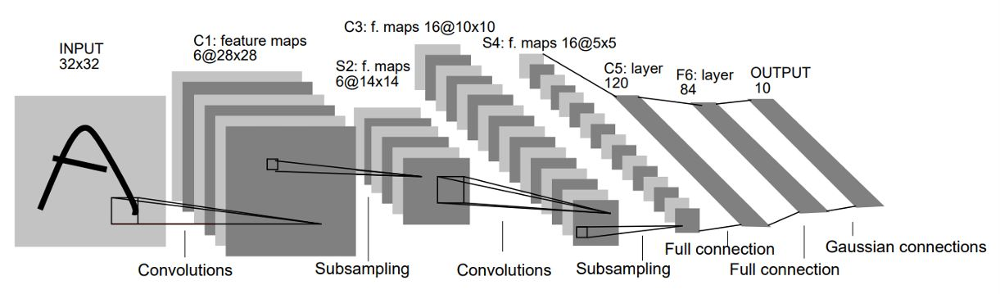
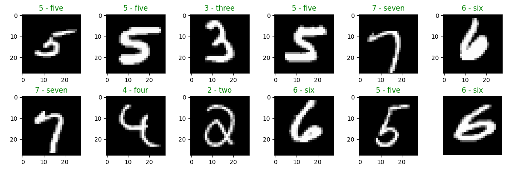

# LeNet Exercise

Running MNIST dataset

## 1. Hyperparameters

Train/Test Split Ratio: 8:2

Learning Rate: 0.0001

Optimizer Function: Adam

Batch Size: 32

Epoch Numbers: 25

Activation Functions: Tanh

## 2. Training Loss and Accuracy Results

No overfitting appeared

## 3. Result

## 4. Methodology / Approach
Explain the steps, methods, or processes used.

